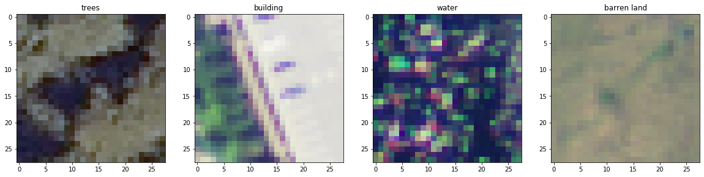

# Satellite Imagery Classification with Deep Learning
## Lisa Taylor
### Springboard Data Science Bootcamp - Capstone Project 2

Satellite imagery is crucial for many applications in agriculture, city planning, natural resource management, environmental monitoring, and disaster response.  Since satellite imagery can cover large areas, the labor costs to manually categorize land uses within the imagery can be prohibitive.  Deep learning has emerged as an important approach for automating land use classification over extensive areas.

For this project, I have applied deep learning using convolutional neural networks (CNNs) to classify satellite image tiles from the [DeepSat-6 dataset available on Kaggle](https://www.kaggle.com/crawford/deepsat-sat6) into six land use classes.  Two approaches were implemented in Keras:  building a custom CNN from scratch and using a pre-trained CNN.  Both approaches achieved over 96% accuracy on held-out data.  

This repository includes three final notebooks: 
* [Data Acquisition, Checking, and Preparation](SatelliteImagery_DataPreparation.ipynb)
* [Satellite Imagery Classification with a Simple CNN](SatelliteImageryClassification-BaselineFinal.ipynb)
* [Satellite Imagery Classification with Transfer Learning](SatelliteImageryClassification-TransferFinal.ipynb)

The results are documented in a [Final Report](Capstone%202%20Final%20Report.pdf) and 
[Final Presentation](Capstone%202%20Final%20Slides.pdf)

